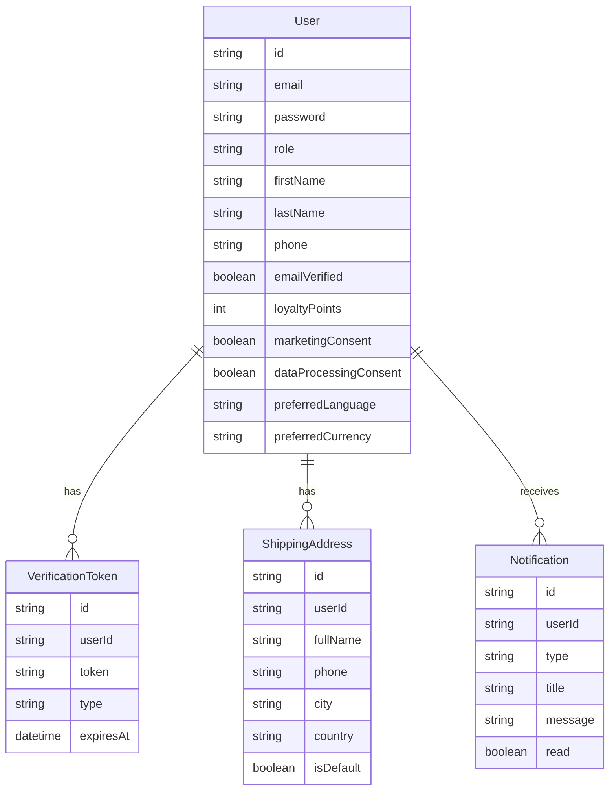
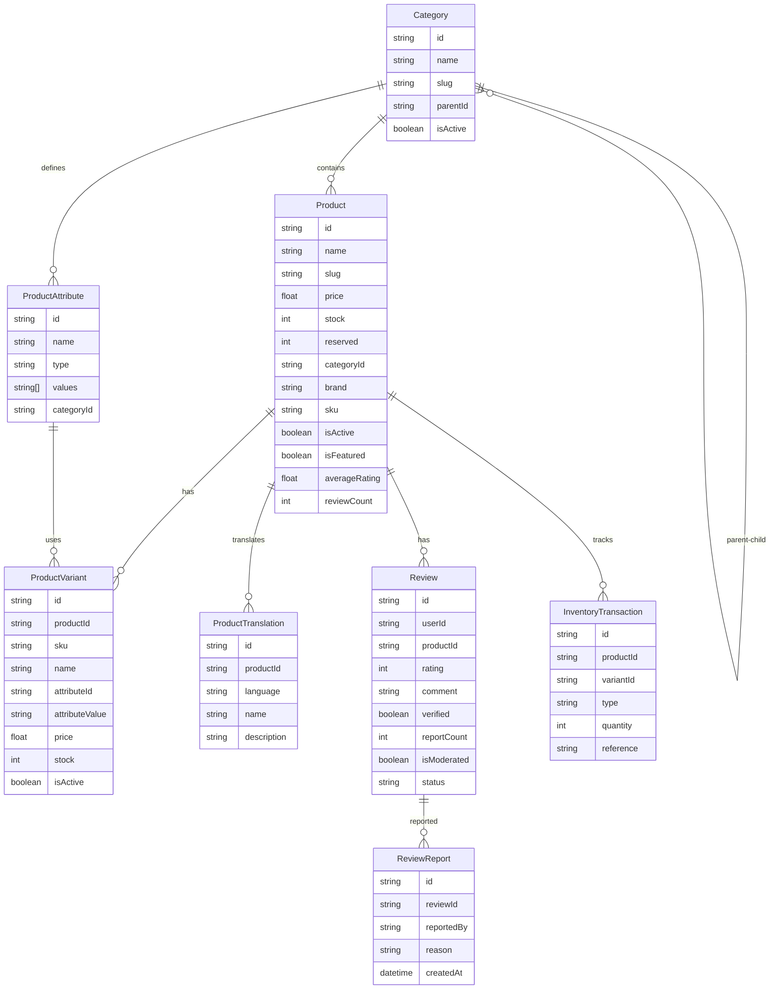
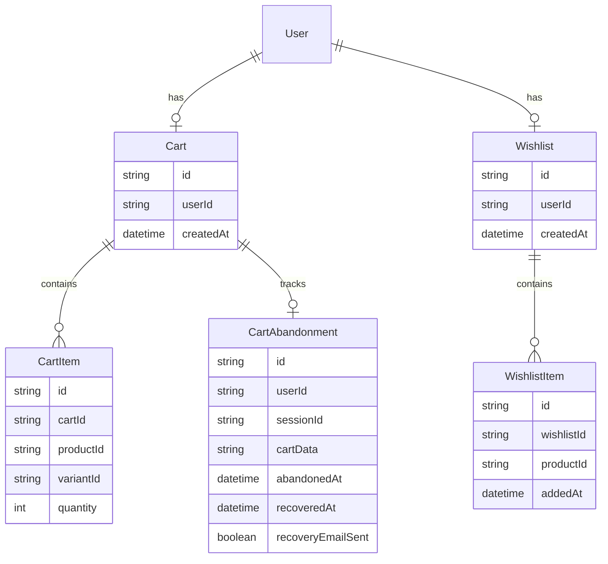
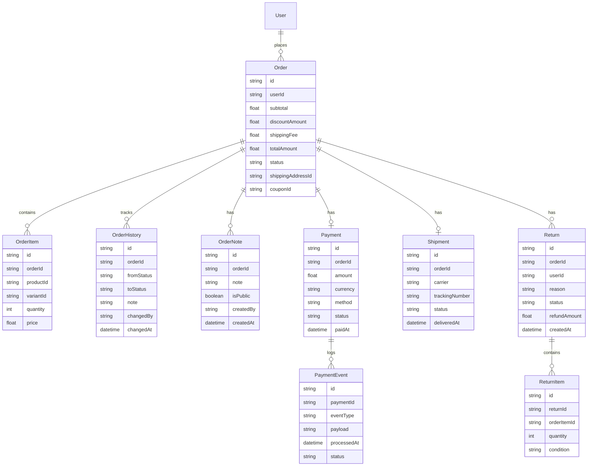
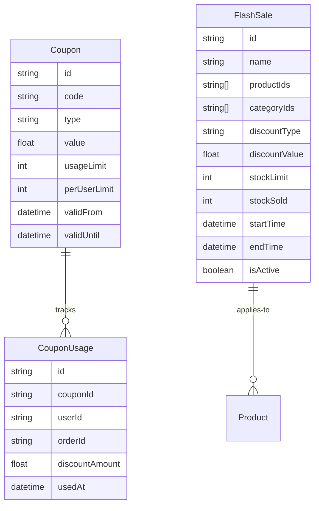
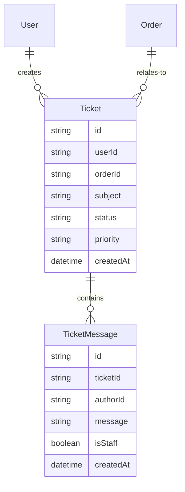
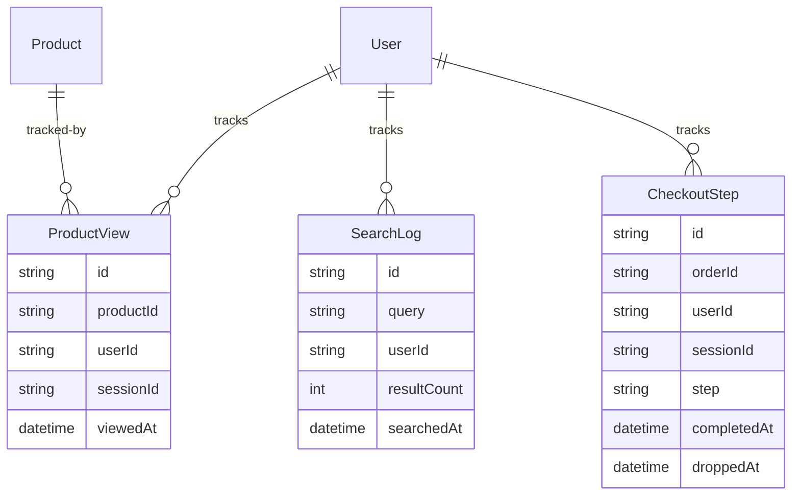
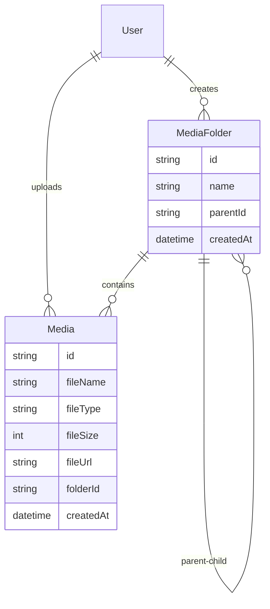

# E-Commerce Database Schema - Production-Ready

> [!NOTE]
> Schema database hoàn chỉnh cho hệ thống e-commerce với **34 entities**, ready for production deployment.

---

## Overview

- **Database**: MongoDB
- **ORM**: Prisma
- **Total Entities**: 34 (+10 from v1)
- **Total Enums**: 15 (+4 from v1)
- **Version**: 2.0 - Production Ready

---

## Entity Relationship Diagrams

### 1. Authentication & User Management



### 2. Product Catalog



### 3. Shopping Cart & Wishlist



### 4. Orders & Payments



### 5. Promotions & Discounts



### 6. Customer Service



### 7. Analytics & Tracking



### 8. Media Management



---

## Complete Entity List (34 Entities)

### Core Entities (24)

| #   | Entity               | Group     | Description              |
| --- | -------------------- | --------- | ------------------------ |
| 1   | User                 | Auth      | User accounts            |
| 2   | VerificationToken    | Auth      | Email/phone verification |
| 3   | ShippingAddress      | Auth      | Delivery addresses       |
| 4   | Notification         | Auth      | User notifications       |
| 5   | Category             | Product   | Product categories       |
| 6   | Product              | Product   | Product information      |
| 7   | ProductVariant       | Product   | Product variations       |
| 8   | Review               | Product   | Product reviews          |
| 9   | InventoryTransaction | Product   | Stock tracking           |
| 10  | Cart                 | Shopping  | Shopping cart            |
| 11  | CartItem             | Shopping  | Cart items               |
| 12  | Wishlist             | Shopping  | Saved items              |
| 13  | WishlistItem         | Shopping  | Wishlist items           |
| 14  | Order                | Orders    | Customer orders          |
| 15  | OrderItem            | Orders    | Order line items         |
| 16  | Payment              | Orders    | Payments                 |
| 17  | Shipment             | Orders    | Shipping                 |
| 18  | Coupon               | Promotion | Discount coupons         |
| 19  | Ticket               | Support   | Support tickets          |
| 20  | TicketMessage        | Support   | Ticket messages          |
| 21  | ProductView          | Analytics | View tracking            |
| 22  | SearchLog            | Analytics | Search tracking          |
| 23  | MediaFolder          | Media     | Folder structure         |
| 24  | Media                | Media     | Uploaded files           |

### New Improvements (10)

| #   | Entity                 | Group     | Description           | Priority  |
| --- | ---------------------- | --------- | --------------------- | --------- |
| 25  | **OrderHistory**       | Orders    | Order status tracking | 🔴 High   |
| 26  | **OrderNote**          | Orders    | Order notes           | 🔴 High   |
| 27  | **CouponUsage**        | Promotion | Coupon usage tracking | 🔴 High   |
| 28  | **Return**             | Orders    | Return requests       | 🟡 Medium |
| 29  | **ReturnItem**         | Orders    | Return line items     | 🟡 Medium |
| 30  | **ReviewReport**       | Product   | Review moderation     | 🟡 Medium |
| 31  | **PaymentEvent**       | Orders    | Payment webhooks      | 🟡 Medium |
| 32  | **ProductTranslation** | Product   | Multi-language        | 🟢 Low    |
| 33  | **ProductAttribute**   | Product   | Attribute schema      | 🟢 Low    |
| 34  | **FlashSale**          | Promotion | Flash sales           | 🟢 Low    |
| 35  | **CartAbandonment**    | Shopping  | Cart tracking         | 🟢 Low    |
| 36  | **CheckoutStep**       | Analytics | Funnel tracking       | 🟢 Low    |

---

## Enumerations

### Existing Enums (11)

#### Role

- `USER` - Regular customer
- `SUPERADMIN` - Administrator

#### OrderStatus

- `PENDING` - Order placed
- `CONFIRMED` - Payment confirmed
- `PROCESSING` - Being prepared
- `SHIPPED` - Shipped
- `DELIVERED` - Delivered
- `COMPLETED` - Completed
- `CANCELLED` - Cancelled
- `REFUNDED` - Refunded

#### PaymentStatus

- `PENDING` - Payment initiated
- `AUTHORIZED` - Authorized
- `CAPTURED` - Captured
- `FAILED` - Failed
- `REFUNDED` - Refunded
- `PARTIALLY_REFUNDED` - Partially refunded

#### PaymentMethod

- `COD` - Cash on delivery
- `BANK_TRANSFER` - Bank transfer
- `MOMO` - MoMo wallet
- `VNPAY` - VNPay
- `STRIPE` - Stripe
- `PAYPAL` - PayPal

#### ShipmentStatus

- `PENDING` - Awaiting pickup
- `PICKED_UP` - Picked up
- `IN_TRANSIT` - In transit
- `OUT_FOR_DELIVERY` - Out for delivery
- `DELIVERED` - Delivered
- `FAILED` - Failed
- `RETURNED` - Returned

#### DiscountType

- `PERCENTAGE` - Percentage discount
- `FIXED_AMOUNT` - Fixed amount
- `FREE_SHIPPING` - Free shipping

#### InventoryTransactionType

- `PURCHASE` - Stock in
- `SALE` - Stock out
- `RETURN` - Return
- `ADJUSTMENT` - Adjustment
- `DAMAGE` - Damage

#### TokenType

- `EMAIL_VERIFICATION` - Email verification
- `PASSWORD_RESET` - Password reset
- `PHONE_VERIFICATION` - Phone verification

#### NotificationType

- `ORDER_CONFIRMED` - Order confirmed
- `ORDER_SHIPPED` - Order shipped
- `ORDER_DELIVERED` - Order delivered
- `PAYMENT_SUCCESS` - Payment success
- `PAYMENT_FAILED` - Payment failed
- `PRICE_DROP` - Price drop
- `BACK_IN_STOCK` - Back in stock
- `REVIEW_REQUEST` - Review request

#### TicketStatus

- `OPEN` - New ticket
- `IN_PROGRESS` - Being handled
- `WAITING_CUSTOMER` - Awaiting response
- `RESOLVED` - Resolved
- `CLOSED` - Closed

#### Priority

- `LOW` - Low priority
- `NORMAL` - Normal priority
- `HIGH` - High priority
- `URGENT` - Urgent priority

### New Enums (4)

#### ReviewStatus (NEW)

- `PENDING` - Pending moderation
- `APPROVED` - Approved
- `REJECTED` - Rejected
- `FLAGGED` - Flagged for review

#### ReturnReason (NEW)

- `DAMAGED` - Received damaged
- `WRONG_ITEM` - Wrong item sent
- `NOT_AS_DESCRIBED` - Not as described
- `CHANGED_MIND` - Changed mind
- `DEFECTIVE` - Product defective
- `OTHER` - Other reason

#### ReturnStatus (NEW)

- `REQUESTED` - Return requested
- `APPROVED` - Approved
- `REJECTED` - Rejected
- `SHIPPED_BACK` - Customer shipped back
- `RECEIVED` - Received by seller
- `REFUNDED` - Refund processed
- `COMPLETED` - Completed

#### AttributeType (NEW)

- `SELECT` - Single selection
- `MULTISELECT` - Multiple selections
- `TEXT` - Text input
- `NUMBER` - Numeric value
- `COLOR` - Color picker

---

## Key Improvements Summary

| Feature                 | v1.0  | v2.0                | Impact   |
| ----------------------- | ----- | ------------------- | -------- |
| **Total Entities**      | 24    | 34                  | +42%     |
| **Order Tracking**      | Basic | ✅ History + Notes  | Critical |
| **Coupon Tracking**     | ❌    | ✅ Usage logs       | Critical |
| **Returns/Exchange**    | ❌    | ✅ Full flow        | High     |
| **Review Moderation**   | ❌    | ✅ Reports + Status | Medium   |
| **GDPR Compliance**     | ❌    | ✅ Consent fields   | High     |
| **Payment Events**      | ❌    | ✅ Webhook logs     | Medium   |
| **Multi-language**      | ❌    | ✅ Translations     | Medium   |
| **Product Attributes**  | JSON  | ✅ Structured       | Medium   |
| **Flash Sales**         | ❌    | ✅ Full support     | Medium   |
| **Conversion Tracking** | ❌    | ✅ Funnel analytics | Low      |

---

## Design Patterns

### 1. Soft Delete

Entities: User, Category, Product, Order

- `deletedAt` - Timestamp
- `deletedBy` - User ID

### 2. Audit Trail

Entities: Category, Product, Order

- `createdAt` + `createdBy`
- `updatedAt` + `updatedBy`
- `deletedAt` + `deletedBy`

### 3. Self-Referencing Hierarchy

Entities: Category, MediaFolder

- `parentId` - FK to same table
- Supports unlimited nesting

### 4. Price Snapshot

Entity: OrderItem

- `price` - Price at time of purchase
- Ensures invoice accuracy

### 5. Reserved Stock

Entity: Product

- `stock` - Available
- `reserved` - Reserved for pending orders
- Prevents overselling

### 6. Denormalization

Entity: Product

- `categoryName` - Cached
- `averageRating` - Cached
- `reviewCount` - Cached

### 7. **Event Sourcing (NEW)**

Entity: OrderHistory, PaymentEvent

- Track all state changes
- Audit trail for compliance
- Debugging & analytics

### 8. **Moderation Pattern (NEW)**

Entity: Review

- `isModerated` + `status`
- Report mechanism
- Admin workflow

### 9. **GDPR Compliance (NEW)**

Entity: User

- Consent tracking
- Timestamp for updates
- User preferences

---

## Implementation Roadmap

### Phase 1: Critical Features (Week 1-2)

**Must implement before launch**

- ✅ OrderHistory - Track all order changes
- ✅ OrderNote - Internal & customer notes
- ✅ CouponUsage - Prevent abuse, analytics

**Effort**: Low | **Impact**: Critical

### Phase 2: Important Features (Week 3-4)

**Enhance customer experience**

- ✅ Return + ReturnItem - Returns/exchanges
- ✅ ReviewReport + ReviewStatus - Content moderation
- ✅ User GDPR fields - Legal compliance
- ✅ PaymentEvent - Payment debugging

**Effort**: Medium | **Impact**: High

### Phase 3: Growth Features (Month 2)

**Scale & optimize**

- ✅ ProductTranslation - i18n support
- ✅ ProductAttribute - Better variant management
- ✅ FlashSale - Marketing campaigns
- ✅ CartAbandonment - Recovery emails
- ✅ CheckoutStep - Funnel optimization

**Effort**: High | **Impact**: Medium

---

## Database Optimization

### Critical Indexes

```javascript
// Orders - Most critical
db.Order.createIndex({ userId: 1, createdAt: -1 });
db.Order.createIndex({ status: 1, createdAt: -1 });
db.OrderHistory.createIndex({ orderId: 1, changedAt: -1 });

// Coupons
db.CouponUsage.createIndex({ couponId: 1, userId: 1 });
db.CouponUsage.createIndex({ userId: 1, usedAt: -1 });

// Returns
db.Return.createIndex({ orderId: 1 });
db.Return.createIndex({ userId: 1, status: 1 });

// Reviews
db.ReviewReport.createIndex({ reviewId: 1 });
db.Review.createIndex({ productId: 1, status: 1, createdAt: -1 });

// Analytics
db.CartAbandonment.createIndex({ userId: 1, abandonedAt: -1 });
db.CheckoutStep.createIndex({ sessionId: 1, completedAt: -1 });

// Flash Sales
db.FlashSale.createIndex({ isActive: 1, startTime: 1, endTime: 1 });
```

---

## Migration Notes

> [!IMPORTANT]
> Khi migrate từ v1.0 → v2.0:

1. **Backward Compatible**: Tất cả entities mới đều optional
2. **Zero Downtime**: Deploy code trước, migrate data sau
3. **Data Backfill**: Chạy scripts để populate historical data nếu cần
4. **Feature Flags**: Enable từng feature một để test

### Migration Checklist

- [ ] Deploy new schema
- [ ] Create indexes
- [ ] Backfill OrderHistory from existing Order logs
- [ ] Enable GDPR fields (default values)
- [ ] Test review moderation flow
- [ ] Configure payment webhook endpoints
- [ ] Set up cart abandonment cron job
- [ ] Test return flow end-to-end

---

## Next Steps

1. **Review** schema với team
2. **Prioritize** theo business needs
3. **Implement** Phase 1 (critical) first
4. **Test** thoroughly before Phase 2
5. **Monitor** performance & adjust indexes

> [!TIP]
> Chi tiết implementation & code examples: [database-analysis.md](./database-analysis.md)
