# Web & CMS Complete Implementation Plan

## Executive Summary

**Current Status:**

- **API Backend**: ~95% complete (50+ modules implemented)
- **Web Frontend**: ~40% complete (basic e-commerce only)
- **CMS Admin**: ~35% complete (basic CRUD only)

**Goal:** Achieve 100% module coverage across all applications

**Timeline:** 8 weeks for full implementation

---

## Database Architecture

### Entity Relationship Diagram

```mermaid
erDiagram
    %% Core User & Auth
    User ||--o{ Order : places
    User ||--o{ Review : writes
    User ||--o| Cart : has
    User ||--o| Wishlist : has
    User ||--o{ ShippingAddress : has
    User ||--o{ Notification : receives
    User ||--o| VerificationToken : has
    User ||--o{ LoginHistory : tracks
    User ||--o{ SecurityEvent : triggers
    User ||--o{ ActivityLog : creates
    User ||--o{ LoyaltyTransaction : earns

    %% Products & Catalog
    Category ||--o{ Product : contains
    Category ||--o{ Category : "parent/child"
    Product ||--o{ ProductVariant : has
    Product ||--o{ OrderItem : ordered_in
    Product ||--o{ CartItem : added_to
    Product ||--o{ Review : reviewed_by
    Product ||--o{ WishlistItem : saved_in
    Product ||--o{ InventoryTransaction : tracks
    Product ||--o{ ProductView : viewed_as
    ProductVariant ||--o{ CartItem : selected_in
    ProductVariant ||--o{ OrderItem : selected_in
    ProductVariant ||--o{ InventoryTransaction : tracks

    %% Orders & Payments
    Order ||--o{ OrderItem : contains
    Order ||--o{ OrderHistory : tracks_changes
    Order ||--o{ OrderNote : has_notes
    Order ||--o{ Payment : paid_by
    Order ||--o{ Shipment : shipped_via
    Order ||--o{ CouponUsage : applied
    Order ||--o{ Return : returned_as
    Order ||--o{ CheckoutStep : tracked_in

    %% Coupons & Loyalty
    Coupon ||--o{ CouponUsage : used_in
    Return ||--o{ ReturnItem : contains

    %% Shopping Cart
    Cart ||--o{ CartItem : contains
    Wishlist ||--o{ WishlistItem : contains

    %% Media & Content
    MediaFolder ||--o{ Media : contains
    MediaFolder ||--o{ MediaFolder : "parent/child"

    %% Blog System
    BlogCategory ||--o{ BlogPost : categorizes
    BlogPost ||--o{ BlogComment : has
    BlogComment ||--o{ BlogComment : "parent/child"
    User ||--o{ BlogPost : authors
    User ||--o{ BlogComment : comments

    %% CMS Pages & Menus
    Menu ||--o{ MenuItem : contains
    MenuItem ||--o{ MenuItem : "parent/child"

    %% Forms & Settings
    Form ||--o{ FormSubmission : receives

    %% Reviews & Moderation
    Review ||--o{ ReviewReport : reported_as
    User ||--o{ ReviewReport : reports

    %% Marketing
    User ||--o{ Banner : creates
    User ||--o{ Popup : creates

    %% Emails
    EmailTemplate }o--o{ EmailLog : uses
    User ||--o{ EmailLog : receives

    %% Landing Pages
    LandingPage ||--o{ LandingPageVariant : has_variants
    LandingPage ||--o{ LandingPageAnalytics : tracks

    %% Analytics
    User ||--o{ ProductView : views
    User ||--o{ SearchLog : searches
    User ||--o{ CartAbandonment : abandons

    %% Scheduler
    Webhook }o--o{ WebhookEvent : listens_to
```



---

## Gap Analysis

### Missing Modules Breakdown

#### **Web App - Missing 15 Major Features**

1. ❌ Wishlist/Favorites
2. ❌ Order History with Tracking
3. ❌ Profile Edit & Shipping Addresses
4. ❌ Review Submission
5. ❌ Product Search & Advanced Filters
6. ❌ Blog Pages
7. ❌ CMS Pages (About, Contact, etc.)
8. ❌ Landing Pages
9. ❌ Loyalty Points Display
10. ❌ Notifications Center
11. ❌ Promotional Banners/Popups
12. ❌ Product Recommendations
13. ❌ Email Subscriptions
14. ❌ Live Search
15. ❌ Product Comparison

#### **CMS App - Missing 25 Major Features**

1. ❌ Payment Management
2. ❌ Shipment Tracking
3. ❌ Coupon/Promotion Management
4. ❌ Return/Refund Workflow
5. ❌ Inventory Management
6. ❌ Product Variants Management
7. ❌ Review Moderation
8. ❌ Pages Management
9. ❌ Menu Builder
10. ❌ Form Builder & Submissions
11. ❌ Landing Page Builder
12. ❌ Banner/Popup Management
13. ❌ Email Template Editor
14. ❌ Email Campaign Management
15. ❌ Loyalty Program Management
16. ❌ Sales Analytics
17. ❌ Product Performance
18. ❌ Customer Analytics
19. ❌ Conversion Reports
20. ❌ Cart Abandonment Management
21. ❌ Role & Permission Management
22. ❌ Activity Logs
23. ❌ Security Monitor
24. ❌ Webhook Configuration
25. ❌ Scheduler Management

---

## 5-Phase Implementation Plan

### **Phase 1: E-commerce Core (Weeks 1-2)**

#### Web Development

**Priorities:**

1. Wishlist functionality
2. Order history page with status tracking
3. User profile edit page
4. Shipping address CRUD
5. Review submission form
6. Product search with filters
7. Product sorting options

**Deliverables:**

- `/account/orders` - Order history page
- `/account/profile` - Profile edit
- `/account/addresses` - Address management
- `/wishlist` - Wishlist page
- Product search component
- Review submission flow

#### CMS Development

**Priorities:**

1. Payment management UI
2. Shipment tracking interface
3. Coupon CRUD operations
4. Return/refund approval workflow
5. Product variant management
6. Inventory tracking dashboard

**Deliverables:**

- `/dashboard/payments` - Payment list & details
- `/dashboard/shipments` - Tracking interface
- `/dashboard/coupons` - Coupon management
- `/dashboard/returns` - Returns workflow
- `/dashboard/inventory` - Stock management
- Product variant editor in product form

---

### **Phase 2: Content Management (Weeks 3-4)**

#### Web Development

**Priorities:**

1. Blog listing & detail pages
2. CMS pages rendering
3. Landing page support
4. Dynamic menus

**Deliverables:**

- `/blog` - Blog listing
- `/blog/[slug]` - Blog post detail
- `/pages/[slug]` - Dynamic CMS pages
- `/landing/[slug]` - Landing pages
- Dynamic navigation menus

#### CMS Development

**Priorities:**

1. Pages CRUD with rich editor
2. Menu builder interface
3. Form builder with field types
4. Form submissions viewer
5. Banner management
6. Popup configuration

**Deliverables:**

- `/dashboard/pages` - CMS Pages CRUD
- `/dashboard/menus` - Menu builder
- `/dashboard/forms` - Form builder & submissions
- `/dashboard/banners` - Banner management
- `/dashboard/popups` - Popup campaigns

---

### **Phase 3: Marketing & Automation (Weeks 5-6)**

#### CMS Development

**Priorities:**

1. Email template visual editor
2. Email campaign creation
3. Landing page builder with sections
4. A/B test configuration
5. Campaign analytics

**Deliverables:**

- `/dashboard/emails/templates` - Template editor
- `/dashboard/emails/campaigns` - Campaign manager
- `/dashboard/landing-pages` - Page builder
- `/dashboard/landing-pages/[id]/variants` - A/B testing
- Campaign performance dashboard

#### Web Development

**Priorities:**

1. Banner display component
2. Popup trigger system
3. Email subscription forms
4. Promotional badges

**Deliverables:**

- Banner carousel component
- Smart popup triggers
- Newsletter subscription
- Sale/discount badges

---

### **Phase 4: Analytics & Customer Insights (Week 7)**

#### CMS Development Only

**Priorities:**

1. Sales analytics dashboard
2. Customer behavior analytics
3. Product performance reports
4. Conversion funnel visualization
5. Cart abandonment dashboard
6. Marketing ROI reports

**Deliverables:**

- `/dashboard/analytics/sales` - Sales metrics
- `/dashboard/analytics/customers` - Customer insights
- `/dashboard/analytics/products` - Product performance
- `/dashboard/analytics/conversion` - Funnel analysis
- `/dashboard/analytics/abandonment` - Cart recovery
- Export reports functionality

---

### **Phase 5: Admin & Security (Week 8)**

#### CMS Development Only

**Priorities:**

1. Role & permission management
2. Activity log viewer
3. Security events monitor
4. Login history dashboard
5. IP blacklist management
6. Webhook configuration
7. Cron job management
8. System settings

**Deliverables:**

- `/dashboard/admin/roles` - Role management
- `/dashboard/admin/activity` - Activity logs
- `/dashboard/admin/security` - Security events
- `/dashboard/admin/logins` - Login history
- `/dashboard/admin/ip-blacklist` - IP management
- `/dashboard/admin/webhooks` - Webhook config
- `/dashboard/admin/scheduler` - Cron jobs
- `/dashboard/settings` - System configuration

---

## Technical Implementation Guidelines

### Web App Architecture

```
apps/web/src/
├── app/
│   ├── (auth)/          # ✅ Done
│   ├── account/         # ⚠️ Expand
│   │   ├── orders/      # ❌ To Add
│   │   ├── profile/     # ❌ To Add
│   │   └── addresses/   # ❌ To Add
│   ├── wishlist/        # ❌ To Add
│   ├── blog/            # ❌ To Add
│   ├── pages/           # ❌ To Add
│   └── landing/         # ❌ To Add
├── data/api/            # Expand API clients
│   ├── wishlist.api.ts
│   ├── blog.api.ts
│   ├── pages.api.ts
│   └── ... (15+ more)
└── components/          # Reusable components
```

### CMS App Architecture

```
apps/cms/src/
├── app/(dashboard)/
│   ├── payments/        # ❌ To Add
│   ├── shipments/       # ❌ To Add
│   ├── coupons/         # ❌ To Add
│   ├── returns/         # ❌ To Add
│   ├── inventory/       # ❌ To Add
│   ├── pages/           # ❌ To Add
│   ├── menus/           # ❌ To Add
│   ├── forms/           # ❌ To Add
│   ├── banners/         # ❌ To Add
│   ├── popups/          # ❌ To Add
│   ├── emails/          # ❌ To Add
│   ├── landing-pages/   # ❌ To Add
│   ├── analytics/       # ❌ To Add
│   ├── loyalty/         # ❌ To Add
│   └── admin/           # ❌ To Add
└── data/api/            # Expand API clients
```

---

## Module Coverage Roadmap

| Week | Web Modules                                           | CMS Modules                                                     |
| ---- | ----------------------------------------------------- | --------------------------------------------------------------- |
| 1-2  | Wishlist, Orders, Profile, Addresses, Reviews, Search | Payments, Shipments, Coupons, Returns, Inventory, Variants      |
| 3-4  | Blog, Pages, Landing, Menus                           | Pages, Menus, Forms, Banners, Popups                            |
| 5-6  | Banner Display, Popups, Subscriptions                 | Email Templates, Campaigns, Landing Builder, A/B Testing        |
| 7    | -                                                     | Analytics (Sales, Customers, Products, Conversion, Abandonment) |
| 8    | -                                                     | Admin (Roles, Logs, Security, Webhooks, Scheduler, Settings)    |

---

## Success Metrics

**Phase 1 Complete:** Web reaches 70%, CMS reaches 60%  
**Phase 2 Complete:** Web reaches 85%, CMS reaches 75%  
**Phase 3 Complete:** Web reaches 95%, CMS reaches 85%  
**Phase 4 Complete:** CMS reaches 95%  
**Phase 5 Complete:** CMS reaches 100%

**Final Target:** Web 95%+, CMS 100% module coverage
